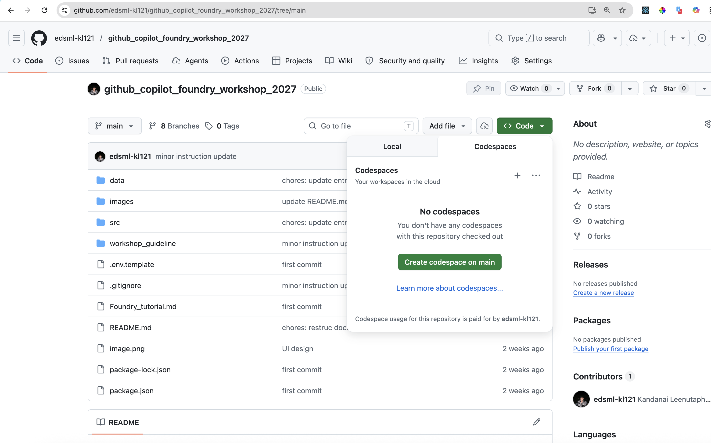
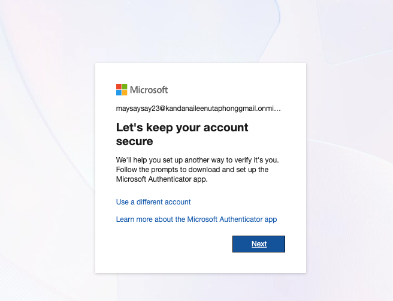
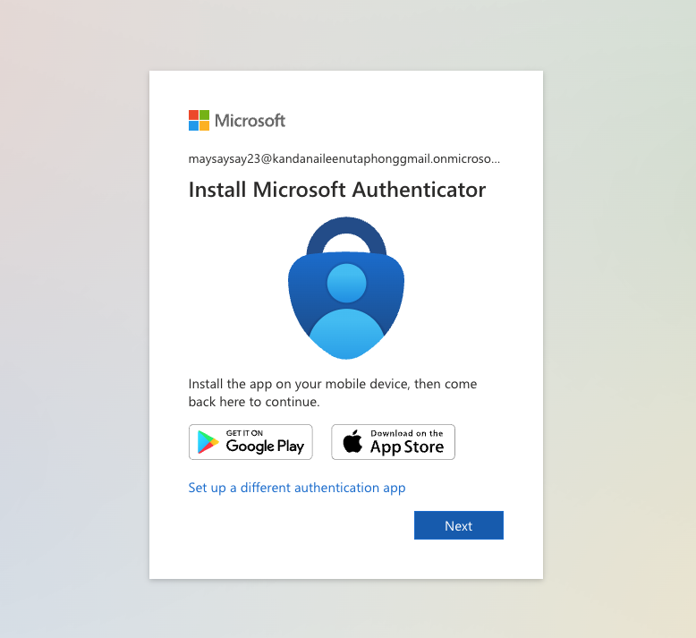
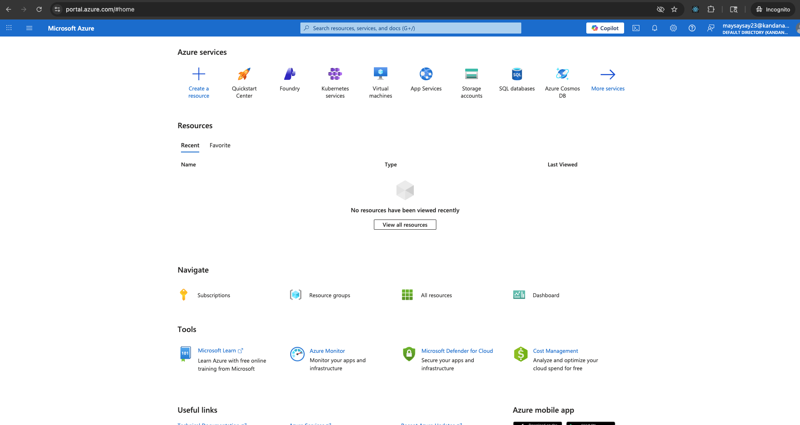
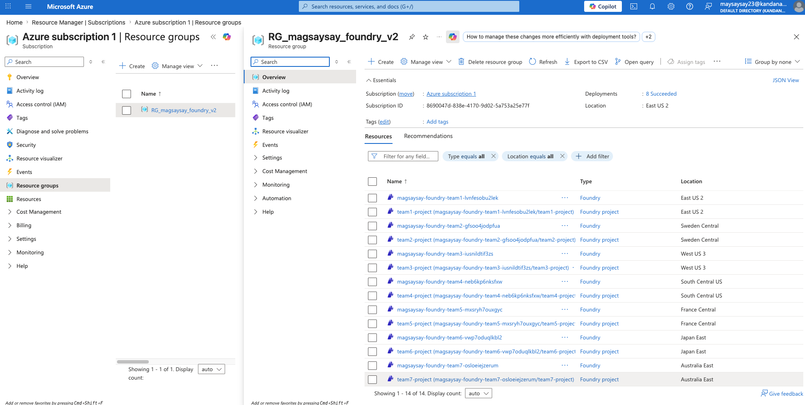

# Pre-requisites


### Installation


Please create a GitHub account and share it to the instructor prior event (Share email or github username), so your license can be assigned.

***Preferred Option**

Please log in to your GitHub Account and test if github codespaces work fine for this repository:

Locate to https://github.com/edsml-kl121/github_copilot_foundry_workshop_2027 > code > `Create codespace on main`



Ensure there are no firewall blocking your access. If there are any firewall issues please let the instructor know before hand.

***Backup Option****

Install the latest version of Visual Studio Code and verify that it launches successfully. (Otherwise we will use code spaces)

https://code.visualstudio.com/download

Please ensure you have installed node.js at https://nodejs.org/en/download

Then check if the following runs sucessfully
```
npm -v 
node -v
```

Please also download python version 3.11 or 3.13. https://www.python.org/downloads/

```
python --version
```

if during the workshop you experience any difficulty with e.g. installing VS code or your company blocks to install certain package please use github codespaces instead.

### Log into your instructor provided account

Please locate to `portal.azure.com`. Sign in with the user name and password provided by the instructor.



Please install the `Microsoft Authenticator` app on your iphone:



Continue and scan QR code and press next until you are logged in.


Locate to Subscription > resource group. You should see the following resources avaliable for you.




### Getting Ready


ONLY If you are installing VS code on your machine instead of using codespaces then:

Please clone or download the repo. (See here for Git installation https://git-scm.com/book/en/v2/Getting-Started-Installing-Git):
```
git clone https://github.com/edsml-kl121/github_copilot_foundry_workshop_2027.git
```

```
cd github_copilot_foundry_workshop_2027
```

Next duplicate `.env.template` file and rename it to `.env`. Then please replace the following environmental variable `FOUNDRY_ENDPOINT`, `FOUNDRY_API_KEY`, `FOUNDRY_PROJECT_ENDPOINT` provided by the instructor.