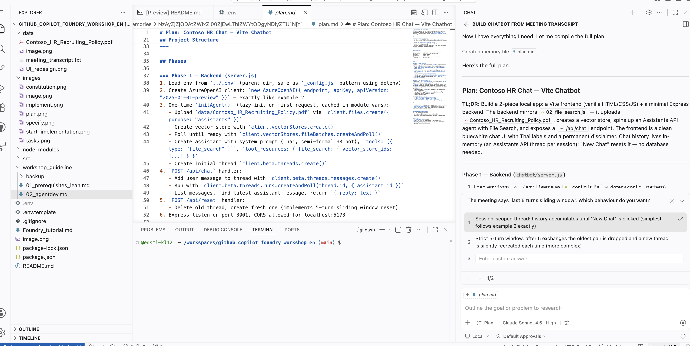
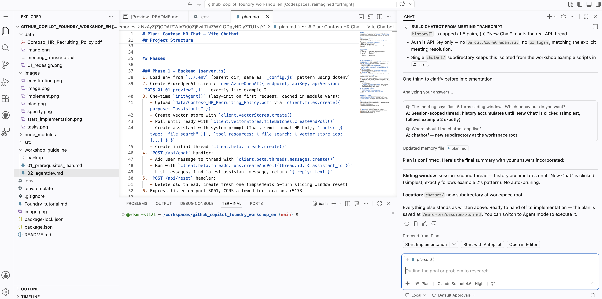
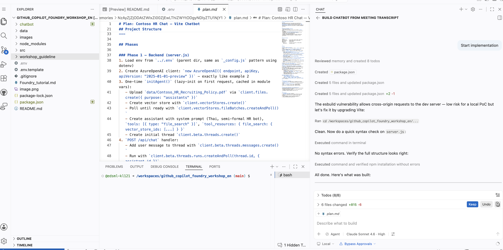
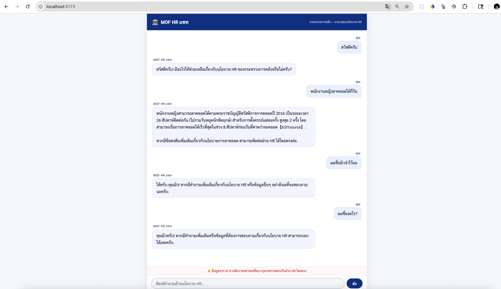

### Option 2 Plan and Agent mode:

Switch your agent to Plan mode. Type the following with `claude-sonnet-4.6`
```
Please read the meeting transcript at data/meeting_transcript.txt first — it has all the decisions we made about what to build. Then build the chatbot based on that.

The app uses Azure AI Foundry with File Search tool, source files are in /data. Build it with Vite but keep it vanilla HTML, CSS, and JavaScript as much as possible, minimal libraries. Chat history should just live in memory, no database needed.

For any Foundry API calls, follow the examples already in src/01_basic_chat.js, src/02_file_search.js, and src/03_image.js — don't invent your own patterns.
```
This is the response of plan mode, fill in QA as required:



Once done press `start implementation`





### Chatting to the chatbot

To start the app try:

```
npm run dev
```

Here are some questions to test the chatbot

```
Q1) Hi! Are there any AI-related positions currently open? Is remote work available?
Q2) My application status shows 'On Hold' — what does that mean?
Q3.1) Can I do the interview on a Saturday?
Q3.2) And what if I need to reschedule? How many times can I do that?
Q4) Does Contoso have a branch in Singapore?
```

Response you should see
```
A1) Yes! We're hiring an AI Solutions Architect in the Innovation department — full-time and fully remote. You can find the full description on the Contoso Careers portal.
A2) "On Hold" means your application is paused and will be revisited within 30 days. For details specific to your case, please contact careers@contoso.com.
A3.1) Standard interview hours are Mon–Fri, 9:00 AM – 5:00 PM ICT. Weekend slots are possible but depend on your recruiter's availability — just ask them when they reach out.
A3.2) You can reschedule up to 2 times without penalty, as long as you give 24-hour notice. A 3rd reschedule needs hiring manager approval.
A4) I don't have information about Contoso's branch locations. Please check with hr@contoso.com for accurate details.
```



Select agent mode and type the following

```
Generate system design document and use mermaid to generate markdown file called documentation.md
```
(If you haven't already please install the `Markdown Preview Mermaid support` extension from VS code)

switch to GPT-5.4 and agent mode. Type the following prompt
```
Please redesign UI to look like <path_to_image>
```
Look at how our UI design look just like the image we chose:
