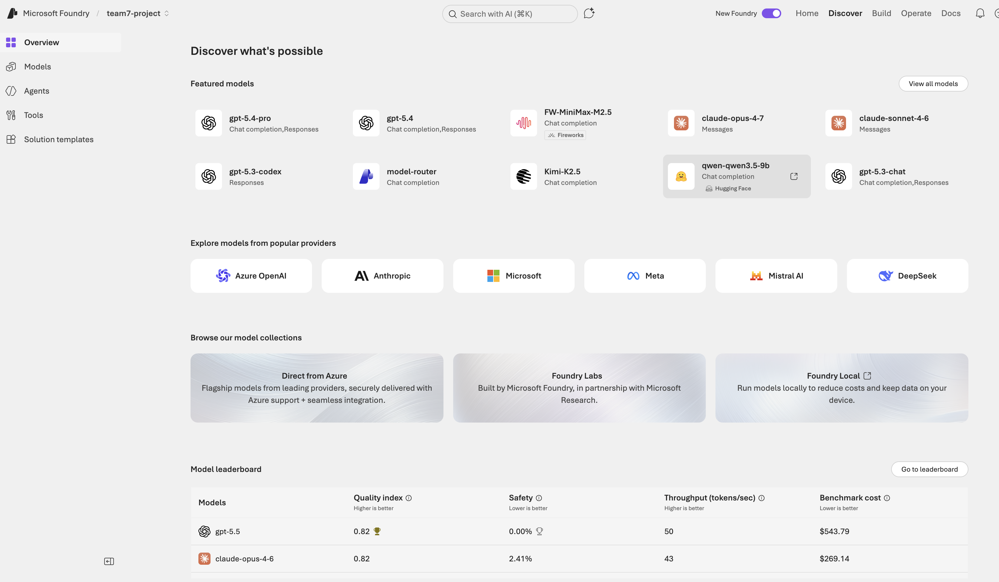
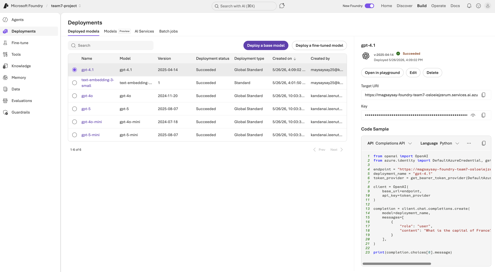
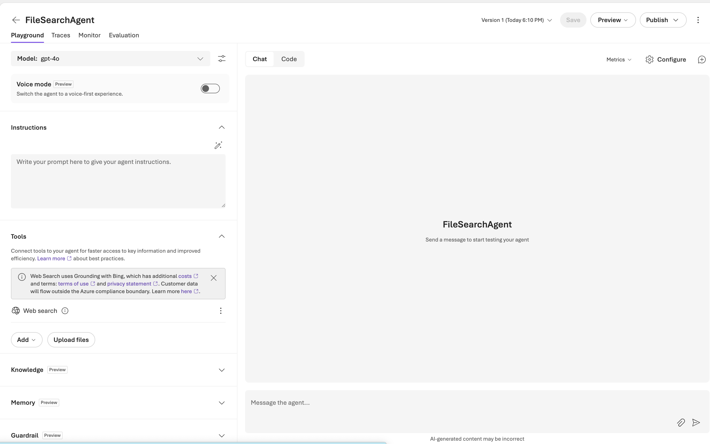
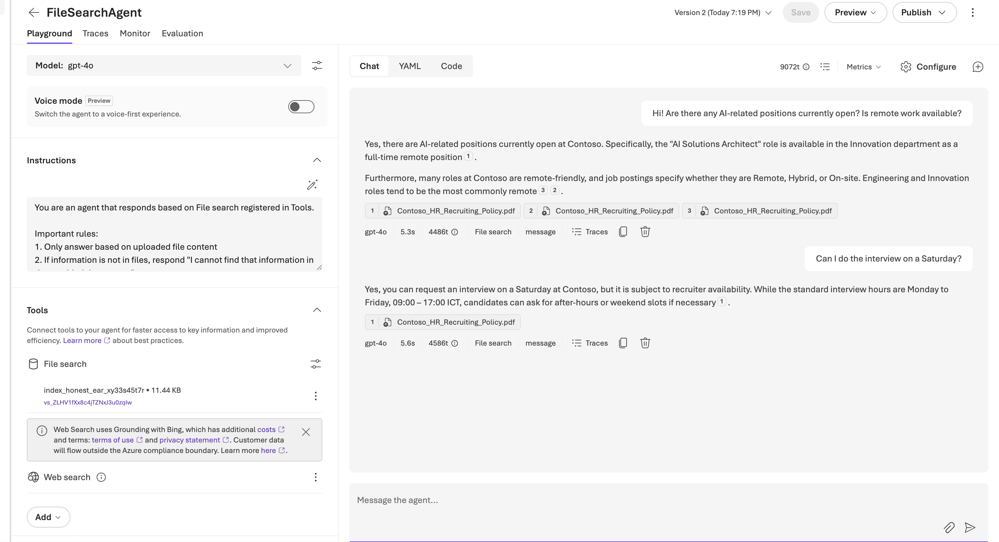
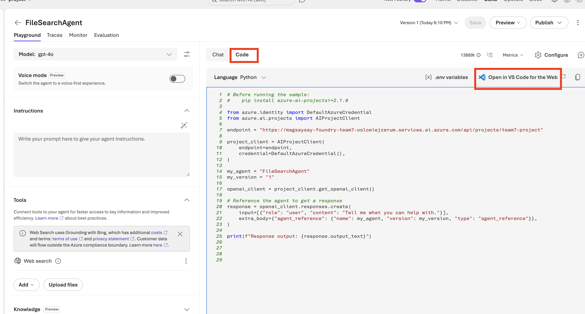
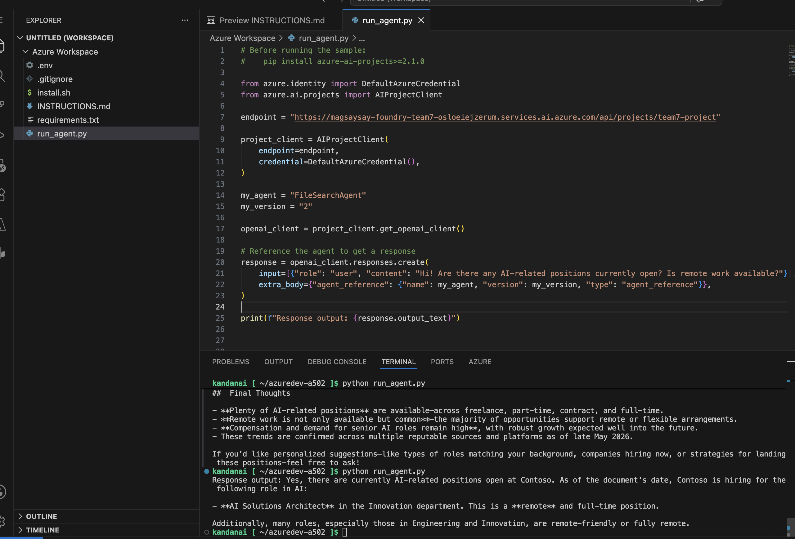

# 01. Models and Deployment

## Discover Models

You can explore various AI models in the Discover section of the Foundry portal.

### Step-by-Step Guide

1. **Navigate to Discover Section**
   - Click **Discover** in the top right menu of the Foundry portal.




### 💡 Tips

- Check the leaderboard regularly for the latest model updates
- Review each model's capabilities and limitations on its detail page

---

## Deploy Models

Models have already been deployed for this workshop.

### Check Deployed Models

1. **Open Build > Deployments**
   - Go to **Build** in the Foundry portal.
   - Select the **Deployments** menu.
   - Confirm your deployed models are available and in **Succeeded** status.



2. **Optional: Create a New Deployment**
   - If you want to create a model deployment yourself, use the **Discover > Models** flow and click **Deploy** on your preferred model.
   - You can use **Compare models** first to select the best fit for quality, speed, and cost.

### Deploy GPT-5.1 Model (Optional)

**Select and Deploy GPT-5.1**
   - Find **gpt-5.1** in the model list.
   - Click the model card to view detailed information.
   - Click the **Deploy** button.
   - Click **Default settings** to start deployment.
   - Deployment takes approximately 1-2 minutes to complete.

### ✅ Verification Checklist

- Verify deployed `gpt-5.1` model in Build > Models section
- Confirm deployment status is "Succeeded"
- Check that Endpoint URL was created


# 02. Agent Development

This module teaches you how to create a File Search agent that answers questions from uploaded recruiting policy documents.

### What is a Microsoft Foundry Agent?

A Microsoft Foundry Agent is an intelligent system that understands user requests and performs tasks using appropriate tools and knowledge.

### Key Components

```
Agent = Model + Instructions + Tools + Knowledge
```

- **Model**: Base language model (GPT-5.1, Claude, etc.)
- **Instructions**: Agent behavior guidelines and persona
- **Tools**: File Search, Web Search, Function Calling, etc.
- **Knowledge**: Connected knowledge base (Foundry IQ)

---

## Create FileSearchAgent

Create an agent that finds information from uploaded documents using file search functionality.


1. **Create New Agent**
   ```
   Agent name: FileSearchAgent
   Model: gpt-4o
   ```


2. **Instructions Configuration**

   Enter the following in the **Instructions** section of Playground:
   ```
   You are an agent that responds based on File search registered in Tools.

   Important rules:
   1. Only answer based on uploaded file content
   2. If information is not in files, respond "I cannot find that information in the provided documents"
   3. Mention source file name in responses
   4. Use accurate citations
   ```
   
   Click the **Save** button to save.

   

3. **Add File Search Tool**

   - Click the **+ Add** button in the **Tools** section.
   - Select the **File Search** option.
   - Verify File Search is added to Tools list.

4. **Upload Files**

   - Click the **Attach files** button in the **Tools > File Search** section.
   - Upload the **Contoso_HR_Recruiting_Policy.pdf** file.
   - Verify file uploaded successfully.

5. **Save Agent**
   - Click the **Save** button.

6. **Test Agent**

   **Test with these questions in the Chat tab:**

```
Q1) Hi! Are there any AI-related positions currently open? Is remote work available?
Q2) My application status shows 'On Hold' — what does that mean?
Q3.1) Can I do the interview on a Saturday?
Q3.2) And what if I need to reschedule? How many times can I do that?
Q4) Does Contoso have a branch in Singapore?
```




7. **Code**

Please click on *code* area and click on open in VS Code. Change the question to the above question to test the api.



