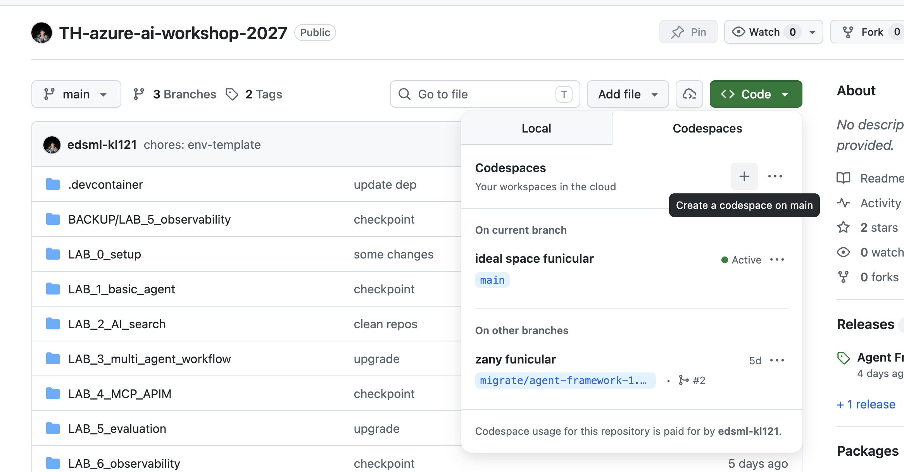
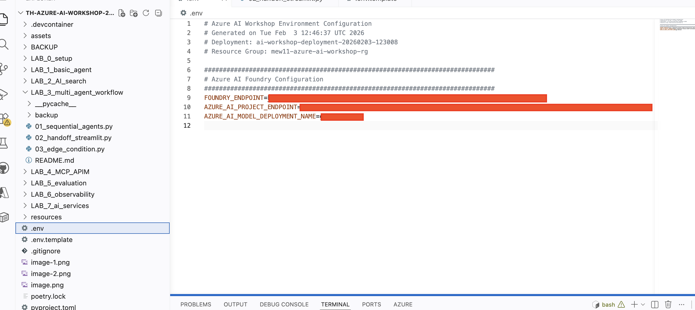

## Agent Framework

We build multi-agent with agent framework

This is the main repository we will use: `https://github.com/edsml-kl121/TH-azure-ai-workshop-2027`

We will focus only LAB_3_multi_agent_workflow: `https://github.com/edsml-kl121/TH-azure-ai-workshop-2027/tree/main/LAB_3_multi_agent_workflow`

Please go to the repository and create a codespace in cloud.




Please fill in the first three environmental variable from the `.env.template`



Then, be sure to login with `az login` and `pip install -r requirement.txt`

```
cd LAB_3_multi_agent_workflow
```

### Exercise 1 (Sequential agents)

```
python 01_sequential_agents.py
```

### Exercise 2 (hand offs in streamlit)

```
streamlit run 02_handoff_streamlit.py
```